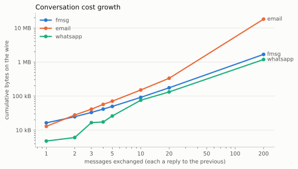

# How many bytes does a message really cost? fmsg vs email vs WhatsApp

I benchmarked three ways of sending a message — [fmsg](https://fmsg.io) (an
open host-to-host messaging protocol), email (SMTP), and WhatsApp — and
measured what actually crosses the wire: every frame, TLS handshakes and
all, from first SYN to last FIN. All three ran over the real internet:
fmsg between production hosts on three domains spanning opposite sides of
the world, email between a self-hosted mail server and Gmail/Outlook —
direct MX-to-MX, no relay — and WhatsApp between two phones' linked
clients. The harness, raw data, and charts are in
[fmsg-bench](https://github.com/markmnl/fmsg-bench).

## Method in one paragraph

Every scenario sends the same content on every system: natural-language
message bodies of exactly 120 bytes, identical attachments. fmsg and
email were captured host-to-host at the local host's network interface;
WhatsApp has no observable host-to-host wire, so its numbers are the
client's traffic to Meta's servers (TCP and UDP — media rides QUIC) less
an idle baseline. Byte counts are stable across repetitions, so fmsg and
email run one repetition per scenario (WhatsApp: five, medians reported).
Scenario IDs read like `m5p2`: 5 messages, 2 participants; `a1m` = 1 MiB
attachment; `x` = recipients on different domains; `-fwd` = bring a third
participant into an existing message. fmsg messages travel inside TLS 1.3
from the first byte, with session resumption: the first-ever contact
between two hosts pays full handshakes, and every connection after that
skips the certificate exchange. Email travels as STARTTLS-upgraded SMTP
on port 25, as mail servers really exchange it.

## Conversations

| messages exchanged | fmsg | email | whatsapp |
|---|---|---|---|
| 1 | 9.6 kB | 25.0 kB | 4.8 kB |
| 5 | 29.3 kB | 92.2 kB | 26.0 kB |
| 20 | 103.9 kB | 425.2 kB | 132.4 kB |
| 100 | **501.2 kB** | —† | — |
| 200 | **998.5 kB** | — | 1.19 MB |

† not yet measured: Gmail rejects direct senders whose IP lacks a custom
PTR record once volume grows (it cut this run off at message 61) — the
point will be added once the reverse-DNS entry lands.

fmsg's line is **flat**: a reply references its parent by a 32-byte hash,
and with TLS session resumption each message costs ~5 kB regardless of
how deep the conversation is — by 200 messages it is the cheapest system
measured, under WhatsApp's single multiplexed connection. Email's replies
quote the entire history each time, so its per-message cost *grows*: by
message 20 it is paying over 20 kB per message and the conversation has
cost **4× fmsg** — and that is with 120-byte messages; the gap widens
with longer ones. Even a single message costs less on fmsg than email
(9.6 kB vs 25.0 kB; the first-ever contact between two hosts pays full
TLS handshakes and costs ~7 kB more, once).

## Attachments

| attachment | fmsg | email | whatsapp |
|---|---|---|---|
| 1 MiB (incompressible) | 1.12 MB | 1.52 MB | 1.14 MB |
| screenshot, 336 kB PNG | 361 kB | 506 kB | 45.7 kB |
| photo, 1.02 MB JPG | 1.08 MB | 1.48 MB | **59.3 kB** |
| document, 377 kB ODT | 417 kB | 566 kB | 419 kB |

fmsg sends raw binary: 5–7% of framing over the file itself. Email still
base64-encodes everything inside MIME: **~45% over the raw file, on
every hop**. WhatsApp's numbers hide a trade: images pass through its
native pipeline and get recompressed — the 1 MB photo travelled as
59 kB, quality silently traded for bandwidth — while documents upload
verbatim (and its servers deduplicate repeat content: sending the same
file twice never uploads it again).

## Bringing someone into a conversation

| action | fmsg | email | whatsapp |
|---|---|---|---|
| add a participant to a sent 1 MiB message | **+9.5 kB** | +1.53 MB | not supported |

This is where protocol design diverges most. fmsg's `add-to` re-sends
only a header; hosts that already hold the message answer "skip the
data", so the attachment never travels again — the newcomer's host
fetches what it lacks and everyone's thread is intact. Email can only
*forward*: the entire MIME body, base64 attachment included, is
re-transmitted — **~160× the bytes** here, and the multiple grows with
the attachment, while fmsg's add-to costs the same whether the message
carried a byte or a gigabyte. WhatsApp has no equivalent at all: adding
someone to a group shares no history with them.

## Recipients on multiple domains

| scenario | fmsg | email |
|---|---|---|
| 1 message → 2 recipients (one remote domain) | 9.7 kB | 20.3 kB |
| 1 message → 2 recipients, different domains | 19.2 kB | 35.1 kB |
| 10-message conversation, 3 participants, 3 domains | 79.1 kB | 259.8 kB |
| 10-message conversation, 4 participants, 3 domains | 89.3 kB | 237.0 kB |

Both protocols fan out per destination from the sender's own host — one
fmsg connection per recipient domain, one SMTP transaction per provider —
so this is a like-for-like comparison of federation cost, and fmsg's
compact framing wins it everywhere: roughly **3× cheaper** across a
multi-domain conversation. WhatsApp has no notion of domains — every
message goes to Meta.

## Capability differences at a glance

| capability | fmsg | email | whatsapp |
|---|---|---|---|
| multiple recipients, one message | native; one transfer per domain | native (To/Cc); one transaction per provider | groups only |
| add participant to a sent message | native, header-only | full re-send (forward) | not supported, no history |
| branching threads | native DAG (32-byte parent ref) | threading headers + re-quoted history | flat chat, quote metadata |
| attachments | raw binary | base64 (+33% encoding) | encrypted upload; images recompressed; dedup |
| transport security | TLS 1.3 required, encrypted from the first byte | opportunistic STARTTLS — preamble in clear, downgradeable unless MTA-STS/DANE | TLS + end-to-end encryption (Signal protocol) |
| federation | any domain, direct host-to-host | any domain via MX — but big providers gate senders on PTR/SPF/DKIM reputation | single closed operator |

## Caveats, honestly

Byte counts proved highly stable across runs on every system; timings
cross the real internet and third-party infrastructure and are indicative
only. fmsg numbers include its challenge-response verification (a second
TLS connection on first contact per thread, under the default
`HAS_NOT_PARTICIPATED` mode) and reflect TLS session resumption between
hosts that have communicated within the ticket lifetime. Email's
100-message point is pending a reverse-DNS fix at the ISP — itself a
finding about what direct SMTP federation demands of a self-hosted
sender. WhatsApp is a closed platform: only client↔server traffic is
measurable, automation used whatsapp-web.js (against WhatsApp's ToS —
tiny volumes, human-like pacing), extra "participants" are a group with
one real second account, and unlike the other two systems it is
end-to-end encrypted. Email's Outlook participant runs via Microsoft
Graph, its Gmail participant via the Gmail API; both reply with standard
threading headers and full quoted history, as real clients do. Every
scenario, command, and software version needed to replicate is in the
repo.

Full tables, figures, per-repetition data and retained packet captures:
[fmsg-bench](https://github.com/markmnl/fmsg-bench).
