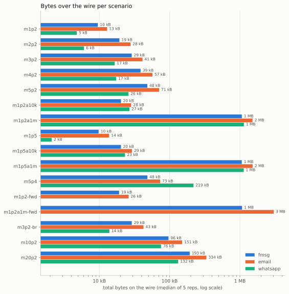
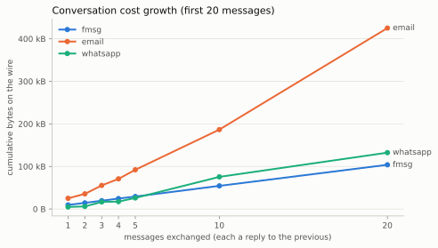
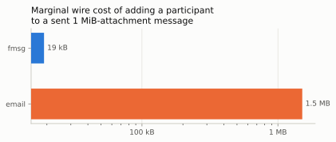

# fmsg-bench results

Bytes over the wire (including TLS framing; total frame bytes of all
TCP conversations, both directions) and first-SYN-to-last-FIN duration,
median of the repetitions per scenario. Raw per-repetition data:
`results.csv`; per-conversation detail: `pcaps/*/*/repN.streams.json`.

## Table 1 — bytes over the wire

| ID | Scenario (user action) | fmsg | email | whatsapp |
|---|---|---|---|---|
| m1p2 | one message to 1 recipient | 9.6 kB | 25.0 kB | 4.8 kB |
| m2p2 | 2 messages between 2 participants, each a reply to the previous | 14.3 kB | 35.6 kB | 6.1 kB |
| m3p2 | 3 messages between 2 participants, each a reply to the previous | 19.5 kB | 55.4 kB | 16.6 kB |
| m4p2 | 4 messages between 2 participants, each a reply to the previous | 24.5 kB | 70.8 kB | 17.4 kB |
| m5p2 | 5 messages between 2 participants, each a reply to the previous | 29.3 kB | 92.2 kB | 26.0 kB |
| m1p5 | one message to 4 recipients | — | 20.9 kB | 2.1 kB |
| m3p2-br | 3 messages between 2 participants, each a reply to the previous; the final two messages are both replies to the first message | 19.7 kB | 49.8 kB | 13.9 kB |
| m5p4 | 5 messages between 4 participants, each a reply to the previous | — | 92.1 kB | 218.8 kB |
| m10p2 | 10 messages between 2 participants, each a reply to the previous | 54.4 kB | 186.6 kB | 75.5 kB |
| m20p2 | 20 messages between 2 participants, each a reply to the previous | 103.9 kB | 425.2 kB | 132.4 kB |
| m1p2a10k | one message to 1 recipient; first message carries a 10 KiB attachment | 20.5 kB | 35.4 kB | 26.8 kB |
| m1p2a1m | one message to 1 recipient; first message carries a 1 MiB attachment | 1.12 MB | 1.52 MB | 1.14 MB |
| m1p5a10k | one message to 4 recipients; first message carries a 10 KiB attachment | — | 36.3 kB | 23.2 kB |
| m1p5a1m | one message to 4 recipients; first message carries a 1 MiB attachment | — | 1.53 MB | 1.13 MB |
| m200p2 | 200 messages between 2 participants, each a reply to the previous | 998.5 kB | — | 1.19 MB |
| m1p2ascr | one message to 1 recipient; first message carries a realistic screenshot (PNG, ~336 kB) | 361.1 kB | 505.8 kB | 45.7 kB |
| m1p2aimg | one message to 1 recipient; first message carries a realistic photo (JPG, ~1.0 MB) | 1.08 MB | 1.48 MB | 59.3 kB |
| m1p2adoc | one message to 1 recipient; first message carries a realistic document (ODT, ~377 kB) | 416.7 kB | 565.8 kB | 418.6 kB |
| m1p2-fwd | one message to 1 recipient; then an additional participant is brought into the message | 19.0 kB | 40.2 kB | — |
| m1p2a1m-fwd | one message to 1 recipient; first message carries a 1 MiB attachment; then an additional participant is brought into the message | 1.12 MB | 3.05 MB | — |
| m10p3x | 10 messages between 3 participants, each a reply to the previous; recipients on two different domains | 79.1 kB | 259.8 kB | — |
| m1p3 | one message to 2 recipients | 9.7 kB | 20.3 kB | — |
| m1p3x | one message to 2 recipients; recipients on two different domains | 19.2 kB | 35.1 kB | — |
| m10p4x | 10 messages between 4 participants, each a reply to the previous; recipients on two different domains | 89.3 kB | 237.0 kB | — |
| m100p2 | 100 messages between 2 participants, each a reply to the previous | 501.2 kB | 4.31 MB | — |

## Table 2 — transmission time (seconds, median)

| ID | fmsg | email | whatsapp |
|---|---|---|---|
| m1p2 | 1.4218 | 3.0309 | 1.6954 |
| m2p2 | 5.58 | 21.5805 | 4.1779 |
| m3p2 | 8.3246 | 22.0655 | 5.8974 |
| m4p2 | 12.4679 | 33.0247 | 6.3253 |
| m5p2 | 15.0876 | 39.1347 | 6.8419 |
| m1p5 | — | 3.3068 | 1.9718 |
| m3p2-br | 8.1239 | 21.2794 | 6.8302 |
| m5p4 | — | 30.033 | 14.7419 |
| m10p2 | 33.0627 | 77.5551 | 25.8924 |
| m20p2 | 68.9416 | 125.5762 | 63.6502 |
| m1p2a10k | 1.381 | 2.9734 | 5.2004 |
| m1p2a1m | 2.521 | 10.1834 | 6.5225 |
| m1p5a10k | — | 3.6363 | 5.2287 |
| m1p5a1m | — | 11.1722 | 5.8949 |
| m200p2 | 5319.4477 | — | 357.2406 |
| m1p2ascr | 2.2252 | 5.1875 | 4.1428 |
| m1p2aimg | 2.6557 | 9.8322 | 4.3586 |
| m1p2adoc | 2.6367 | 6.1158 | 3.4754 |
| m1p2-fwd | 3.2403 | 10.8075 | — |
| m1p2a1m-fwd | 4.894 | 26.8493 | — |
| m10p3x | 99.1835 | 69.6266 | — |
| m1p3 | 1.3966 | 3.0951 | — |
| m1p3x | 5.3897 | 5.1697 | — |
| m10p4x | 103.6115 | 85.8401 | — |
| m100p2 | 360.6928 | 886.5649 | — |

## Figures






## Protocol capability differences

Not every scenario maps onto every system — a '—' in the tables is often
a capability gap, not a missing measurement:

| capability | fmsg | email | whatsapp |
|---|---|---|---|
| multiple recipients on one message | native; one transfer per recipient *domain* | native (To/Cc); one transaction per destination server | not supported — nearest equivalent is a group chat |
| bring a participant into an already-sent message | native (`add-to`): header-only, data never retransmitted | only by forwarding — the full message incl. attachments is re-sent | not supported; adding someone to a group shares no history |
| branching conversations | native: any message can be replied to, forming a DAG (32-byte parent reference) | supported via threading headers; each reply re-quotes history | flat chat; quoted replies reference but do not branch |
| binary attachments | raw binary on the wire | base64-encoded (+33%) inside MIME | encrypted media upload (server dedupes repeat content) |
| reply context | 32-byte parent hash | full quoted history re-sent each reply | quote metadata only |

## Method notes & caveats

- **fmsg**: real production hosts on three domains spanning the world,
  host-to-host fmsg (TCP 4930) captured at the local host and filtered to
  the remote host's IPs. Challenge mode is the fmsgd default
  (HAS_NOT_PARTICIPATED): only first-contact messages incur the
  challenge-response second connection. TLS uses production certificate
  chains with session resumption — connections after the first to a
  given host resume and skip the certificate exchange. Timings cross
  the real internet — indicative, like email's.
- **email**: self-hosted mailcow ↔ Gmail (and, in cross-provider
  scenarios, ↔ Outlook via Microsoft Graph) over the public internet.
  Outbound leaves via a smarthost relay (port 2525) — typical for
  residential hosting where ISPs block direct port 25 — so the measured
  outbound hop is mailcow→relay; inbound is Gmail→mailcow on port 25,
  filtered to Google's published netblocks. Replies are generated via the
  Gmail API with standard threading headers and full quoted history.
  Timings cross the internet and Gmail's internals: indicative, not
  replicable. Submission (client→server) is excluded by design.
- **whatsapp**: closed platform — no host-to-host wire exists to observe.
  Numbers are the measured client's TLS traffic to Meta's servers, less an
  idle baseline (background chatter), captured on a dedicated container
  bridge. Automation via whatsapp-web.js (against WhatsApp ToS; tiny
  volumes, human-like pacing). Extra participants are aliases/groups of
  one benchmark account — see scenario notes.
- Message bodies are natural-language text cut to exactly 120 bytes each;
  attachments are incompressible random bytes (regenerable from a fixed
  seed; unique per repetition on WhatsApp, which dedupes repeat media).
- Repetitions: fmsg and email run one repetition per scenario — their
  byte counts are stable across runs; whatsapp runs five (medians
  reported, idle baseline subtracted). Timings vary — treat every
  duration as indicative.

## Appendix — software versions

```
recorded: 2026-08-11T00:16:25Z
host: Linux 7.1.4-204.fc44.x86_64 x86_64 GNU/Linux

## workspace repos
fmsg-spec: fee8e49 (2026-08-11) [origin/main: c2a5b18]
fmsgd: 5779f14 (2026-08-10)
fmsg-webapi: 06634b4 (2026-08-10) [origin/main: 6ef5136]
fmsgid: 5a74176 (2026-08-03)
fmsg-cli: f450ba5 (2026-08-05) [origin/main: e4ff0ca]
fmsg-docker: 1feebdb (2026-08-11)
fmsg-bench: 49b2b59 (2026-08-11)

## tools
tcpdump version 4.99.6
go version go1.26.4 linux/amd64
Python 3.14.6
jq-1.8.1

## payloads
bd2d6fbef9eee073ec42627be5c21857e5e13b2172c692049092be4356ff965f  /home/markmnl/github.com/fmsg/fmsg-bench/scenarios/payloads/attach-10KiB.bin
fab28477ff0ed0bfa700de7e1449f6e30ff6a7de9cff269d8995a77af0d46adb  /home/markmnl/github.com/fmsg/fmsg-bench/scenarios/payloads/attach-1MiB.bin
230391ff7e0219baa9df49685d8cc3389a0707d031ffe8f209961c9f45f804d8  /home/markmnl/github.com/fmsg/fmsg-bench/scenarios/payloads/body-120B.txt
```

## Appendix — replication

```sh
./scenarios/gen-payloads.sh
./bench.sh fmsg          # real hosts — needs ~/.config/fmsg-bench/fmsg.env
./bench.sh email         # needs mailcow + Gmail OAuth (see README)
./drivers/whatsapp/baseline.sh && ./bench.sh whatsapp
python3 analysis/summarize.py && python3 analysis/charts.py && python3 analysis/report.py
```
